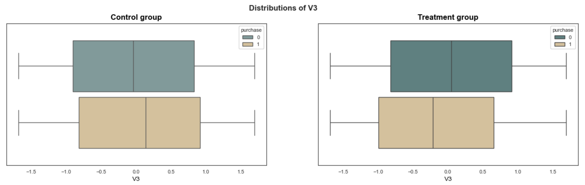
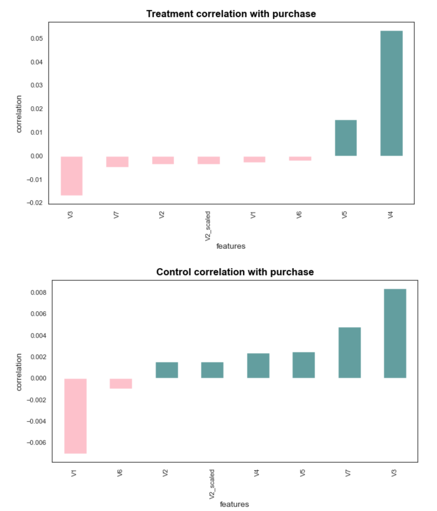
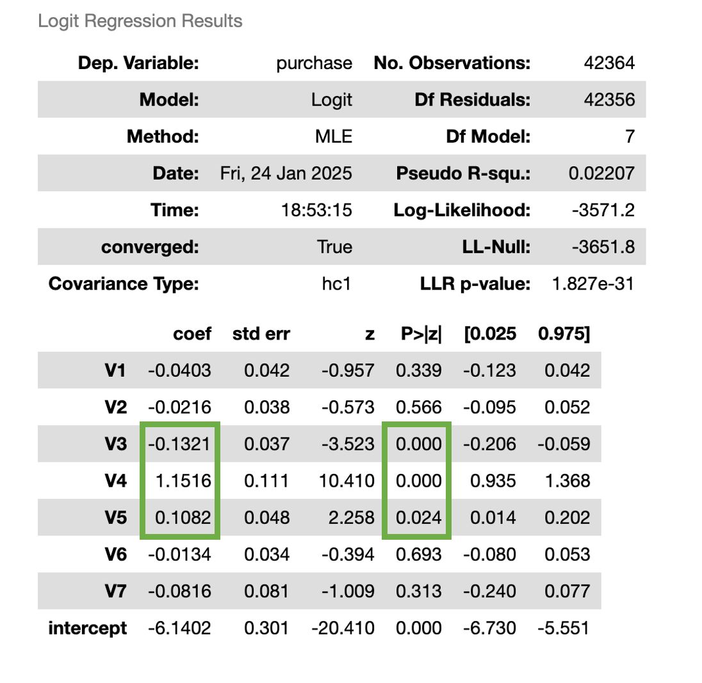

Udacity Data Science Nanodegree
---
## Starbucks take home assignment (formally given to their job applicants)
The purpose of this project is to demonstrate the ability to use AB testing and target market modeling together in a project.

#### Created by: Juanita Smith
#### Last date: January 2025

Starbucks wants to uplift their sales by sending out promotions more selectively 
to only those customers that are more likely to react to promotions and buy the product as a result.

### Table of contents
* [1. Project Overview](#1-project-overview)
* [2. Installation](#2-installation)
* [3. Dataset Overview](#3-dataset-overview)
* [4. Notebook overview](#4-notebook-overview)
* [5. Conclusions](#5-conclusions)
  * [Conclusion of Exploratory Data Analysis](#conclusion-of-exploratory-data-analysis)
  * [Conclusion of Hypothesis testing for IRR](#conclusion-of-hypothesis-testing-for-irr)
  * [Conclusion of Hypothesis Testing for NIR](#conclusion-of-hypothesis-testing-for-nir)
  * [Conclusion of promotion strategy](#conclusion-of-promotion-strategy)
* [6. Licensing, Authors, Acknowledgements](#6-licensing-authors-acknowledgementsa-namelicensinga)
* [7. References](#7-references)

# 1. Project Overview

The dataset provided in this portfolio exercise was originally used as a take-home assignment provided by Starbucks for their job candidates. 
The data for this exercise consists of about 120,000 data points split in a 2:1 ratio among training and test files. 
In the experiment simulated by the data, an advertising promotion was tested to see if it would bring more customers
to purchase a specific product priced at $10. 
Since it costs the company 0.15 to send out each promotion, it would be best to limit that promotion only to those 
that are most receptive to the promotion. 

Starbucks wants to measure the success of the experiment using two evaluation metrics:

**Incremental Response Rate (IRR)** 

IRR depicts how many more customers purchased the product with the promotion, as compared to if they didn't receive the promotion.

$ IRR = \frac{purch_{treat}}{cust_{treat}} - \frac{purch_{ctrl}}{cust_{ctrl}} $

**Net Incremental Revenue (NIR)**

NIR depicts how much is made (or lost) by sending out the promotion.
$ NIR = (10\cdot purch_{treat} - 0.15 \cdot cust_{treat}) - 10 \cdot purch_{ctrl}$

The project is divided into two main parts and questions:
1) **AB Testing:**
   - Did more customers buy the product as a result of the promotion? Does the treatment group have a higher IRR and is it significant?
   - Did the promotion generate more revenue? Does the treatment group have a higher NIR and is it significant?
     
2) **Target marketing modeling: Develop a promotion strategy**  
   Identify those customers who should receive promotions that are likely to buy the product consequently using machine learning
   - Who responds better to promotions?
   - How can we identify the target market better to minimize promotion costs?
   - How can we maximize IRR and NIR?

# 2. Installation

To clone the repository. use `git clone https://github.com/JuanitaSmith/ab_testing_starbucks.git`

- Project environment was built using Anaconda.
- Python 3.10 interpreter was used.
- Refer to `requirements.txt` for libraries and versions needed to build your environment.
- Use below commands to rebuild the environment automatically
  - `conda install -r requirements.txt` or 
  - `pip install -r requirements.txt` or 
  - `conda install -c conda-forge --yes --file requirements.txt`
- Refer to `environment.yaml` for environment setup and conda channels used

# 3. Dataset Overview

Each data point includes one column indicating whether an individual was sent a promotion for the product, 
and one column indicating whether that individual eventually purchased that product. 
Each individual also has seven additional features associated with them, which are provided abstractly as V1-V7.

# 4. Notebook overview

Project was split into three notebooks available in folder `/notebooks`
1) EDA to assess, clean and explore data distributions, relationships and patterns.
2) Hypothesis testing answering project question 1.
3) Target market modeling using machine learning answering question 2.

# 5. Conclusions

## Conclusion of Exploratory Data Analysis

Data were quite clean already with no missing values and significant outliers.

Features V3, V4, V5 were identified as the most important features to be used in modeling to best identify customers that react to promotions.

* **V3**: Float with uniform distribution  
Control and Treatment groups have different mean and IQR for those who purchased the product   

* **Treatment vs Control correlation with purchase** 
Most correlated features with purchase for the treatment group is V4, V5 and V3.
Control group have totally different features with an overall weaker correlating with purchase

* **Feature importance:** 
During logistic regression, only features V3, V4 and V5 have a p-value < 0.025.
V3 have a negative effect of purchase whilst V4 and V5 have positive effect on purchase

* **Conclusion:**

Only features V3, V4 and V5 was selected target market modeling.

## Conclusion of Hypothesis testing for IRR

Did the promotion increase sales?

Hypothesis to test:

### $H_0 = \frac{purch_{treat}}{cust_{treat}} - \frac{purch_{ctrl}}{cust_{ctrl}} <= 0$  
### $H_1 = \frac{purch_{treat}}{cust_{treat}} - \frac{purch_{ctrl}}{cust_{ctrl}} > 0$

Reject the null hypothesis.  
The difference of actual 0.9% in IRR is significant with a p-value of 0, thus could not have come from the null.  
Promotions have a positive effect on sales.

## Conclusion of Hypothesis Testing for NIR

How much is made (or lost) by sending out the promotion?

$ NIR = (10\cdot purch_{treat} - 0.15 \cdot cust_{treat}) - 10 \cdot purch_{ctrl}$

Hypothesis to test:

### $H_0 = NIR <= 0 $
### $H_1 = NIR > 0 $

Fail to reject the NULL hypothesis.  
The actual NIR of -2334 is not significant with a p-value of 1.  
There is no evidence that promotions generate more revenue.

## Conclusion of promotion strategy

There are no strong linear relations between independent and dependent features; therefore, a tree-based algorithm was selected.
XGBOOST was selected for this solution due to its extendability to custom metrics and objective functions, 
and extensive hyperparameters to control overfitting.  

This notebook learns the patterns of those individuals who purchased the product after receiving a promotion, using only the treatment dataset.  

XGBOOST algorithm was extended to use a custom metric 'IRR' to maximize individuals who purchased the product after receiving a promotion. 
My thinking is, the more people who purchase the product after receiving a promotion, the more revenue we will make. 
A custom objective function was used to calculate weighted class loss to handle imbalance between classes.

Optuna was used to fine-tune the model with faster hyperparameter searching

### Model performance

# 6. Licensing, Authors, Acknowledgements

Must give credit to Starbucks for the data.

# 7. References

- [XGBOOST handling imbalance with focal loss](https://github.com/handongfeng/Xgboost-With-Imbalance-And-Focal-Loss/blob/master/Xgboost_sklearn.py)
- [XGBOOST understanding algorithm](https://github.com/datacamp/Machine-Learning-With-XGboost-live-training/blob/master/notebooks/Machine-Learning-with-XGBoost-solution.ipynb)
- [Dynamic bin size of histograms](https://medium.com/@maxmarkovvision/optimal-number-of-bins-for-histograms-3d7c48086fde)
